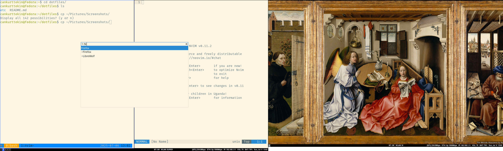

# dotfiles
This repository contains my dotfiles for my lenovo yoga laptop running fedora with sway.

# screenshots

## neovim
- Harpoon
- Supermaven
- Copilot
- Telescope
- CopilotChat
- Treesitter
- UndoTree
- VimFugitive 
- ...

## sway
- Wikiart Wallpaper: changes wallpaper to one of the artwork of the day with artist info on bottom right. deps `swaybg`, `jq`, `imagemagick`

## wofi
- simple solarized drun 

## foot

# branch i3
contains minimal i3 configurations for x11 system
